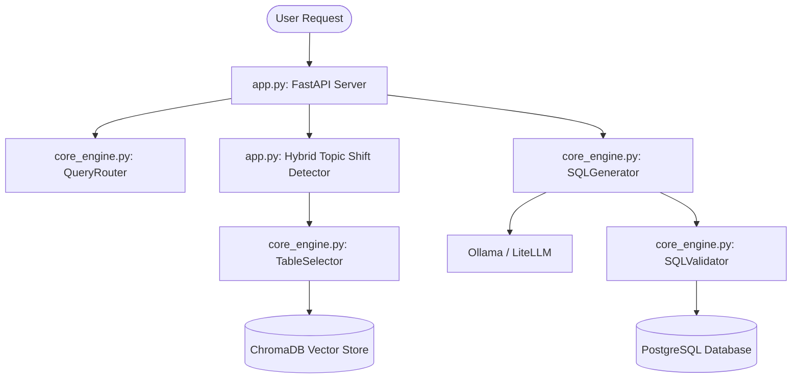

# 🗺️ AI System Map & Knowledge Transfer (KT) Document
> **Welcome, AI Coding Assistant!** This document provides a complete guide to the architecture, database schema, logic pipelines, and critical development rules for the **Triniti Manufacturing RAG Engine**. Read this file before making any changes.

---

## 1. System Overview & Architecture
This codebase is a Production Chatbot app designed to allow manufacturing managers to query factory line data (OEE, wastage, speed, material giveaway) in natural language. It translates user queries to PostgreSQL, runs them, formats the results, and explains them.



### Core Components:
1. **`app.py`**: The FastAPI server entrypoint. Handles SSE streaming, conversation memory state, spelling corrections, and coordinates the pipeline.
2. **`core_engine.py`**: The analytical brain.
   - `KPIEngine`: Extracts domain metrics (OEE, EGA, downtime) and compiles context hints.
   - `TableSelector`: Queries ChromaDB to select relevant database tables based on semantic similarity.
   - `SQLGenerator`: Orchestrates the LLM prompts and feeds them table schemas and global rules.
   - `SQLValidator`: Executes `EXPLAIN` on generated SQL and manages a self-healing reflection loop.
3. **`data_layer.py`**: Manages PostgreSQL database connections, persistent conversational memory (`conversation_turns`), and semantic cache (`semantic_query_cache`).

---

## 2. PostgreSQL Schema & Table Quirks
The database contains **4 main fact tables** and a few dimension tables. You must know their specific columns and time-filtering schemas.

### 📊 Fact Tables:
1. **`oee_details_data`** (Hourly Granularity)
   - *Purpose:* Measures machine OEE, run duration, downtime minutes, good bags, and failed bags.
   - *Time Column:* `start_time` (TIMESTAMP) and `end_time` (TIMESTAMP).
   - *Availability formula:* `(SUM(run_duration)/NULLIF(SUM(run_duration + downtime_mins), 0)) * 100`

2. **`ega_details_data`** (Hourly Granularity)
   - *Purpose:* Measures Extra Giveaway Amount (EGA) to track material giveaway loss.
   - *Time Column:* `start_time` (TIMESTAMP) and `end_time` (TIMESTAMP).
   - *EGA Formula:* `((SUM(t_weight) - SUM(theoretical_pack_weight)) / NULLIF(SUM(t_weight), 0)) * 100`

3. **`wastage_records`** (Shift-wise / 8-Hour Granularity)
   - *Purpose:* Manual waste logs containing wastage weight, flavour, and categories.
   - *Time Column:* **`production_start_time`** and **`production_end_time`** (NEVER use `start_time`!).
   - *Filters:* Shift column has values `'A'`, `'B'`, and `'C'`.

4. **`production_speed_details_data`** (Hourly Granularity)
   - *Purpose:* Tracks machine packaging speeds.
   - *Time Column:* `start_time` (TIMESTAMP).
   - *Note:* Contains a JSON array column `production_speed_bpm` holding minute-by-minute sensor readings.

---

## 3. Conversational Memory & Topic Shift Logic
To handle back-and-forth chat without context drift, the app uses a **Hybrid Topic Shift Detector** in `app.py`:

```python
async def analyze_topic_shift(history: str, new_query: str) -> bool:
    # 1. Fast Path Heuristic Check (Regex looking for it, why, this, compare, and)
    # 2. Slow Path LLM Fallback Check (Asks Ollama if the query is a follow-up or a standalone new topic)
```
- **If follow-up (YES):** Merges previous chat context with the new query so the table selector and SQL generator maintain the date and machine filters.
- **If new topic (NO):** Calls `conversation_manager.clear_session()` to clear the memory and start fresh.

---

## 4. 🚨 Critical AI Coding Rules (The "Must-Obey" List)
Any AI modifying this codebase must adhere strictly to these validation and SQL-generation rules:

### SQL & Postgres Constraints:
*   **Case Insensitivity:** Always use `ILIKE` instead of `=` for text/variant fields (e.g., `variant ILIKE '%Ridge Cut%'`).
*   **NO NESTED AGGREGATES:** PostgreSQL forbids nested aggregates like `AVG(SUM(...))` or `MAX(SUM(...))`. If you need to aggregate a calculated metric, you **must** use a CTE or a Subquery.
*   **Division Safety:** ALWAYS wrap division denominators in `NULLIF` (e.g., `a / NULLIF(b, 0)`) to prevent `DivisionByZeroError`.
*   **Native Columns:** Do NOT join the `machines` table just to get `machine_name` or `loop_name`. These columns are already natively available in the fact tables (`ega_details_data`, `oee_details_data`, etc.).
*   **Grammage Filters:** Grammage is stored as a pure `NUMERIC` value. Never filter it using a string suffix (use `grammage = 100`, not `grammage = '100g'`).

---

## 5. Development & Testing Commands
- **Start the Unified App (Backend & Frontend):**
  ```bash
  bash START_APP.sh
  ```
  *(Frontend is served directly on http://localhost:8000)*
  
- **Batch Accuracy Test Suite:**
  ```bash
  python3 scratch/retry_dropped.py
  ```
  *(Test outcomes are saved in `config/test_results_parallel.json`)*
